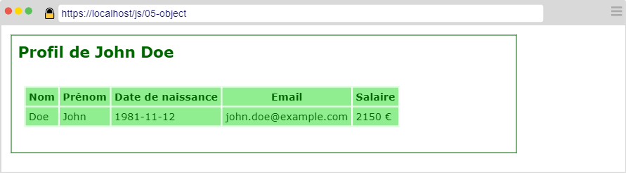
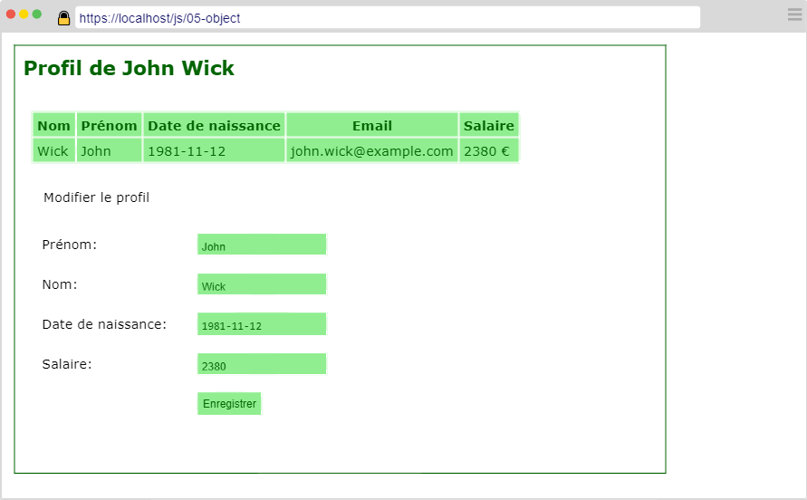

---
title: "Manipuler un Objet"
serie: "frontend"
order: 7
--- 

Soit l'objet littéral suivant :

```js
const myEmployee = {
    lastname: "Doe", 
    firstname: "John", 
    birthday: "1981-11-12", 
    salary: 2150
}
```

A partir de cet objet, vous devez créer une page web permettant de le modifier.

# Exercice 1 : Affichage

Créer un document HTML contenant : 
- Un titre de niveau 1
- Un tableau représentant les informations de John Doe. 

Implémentez le code nécessaire (html, css et js) afin que votre page respecte la maquette suivante :



L'adresse email est générée à partir du nom et prénom. Le format est le suivant : `nom.prenom@example.com`


# Exercice 2 : Modification

A la suite du tableau, Ajouter un formulaire permettant de modifier la personne. Le formulaire est pré-rempli avec les informations de la personne en objet.


Au clic sur le bouton "enregistrer", les informations sont mises à jour et l'adresse email est regénérée.



Vous prendrez soin d'effectuer les contrôles de saisie nécessaire : 

- Le nom et prénom ne peuvent contenir que des lettres
- Le nom et prénom contiennent au moins 2 lettres
- La date de naissance est obligatoirement dans le passé
- le salaire ne peut être inférieur au salaire précédent
