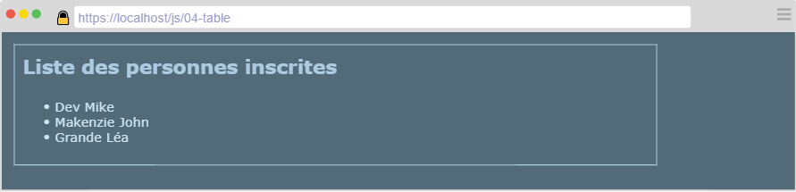
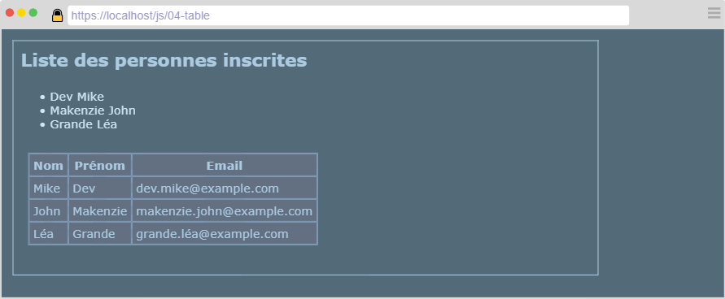
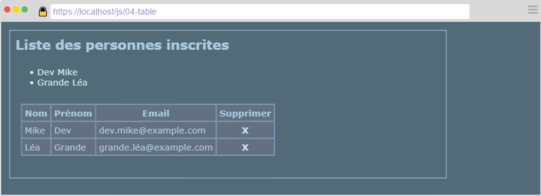
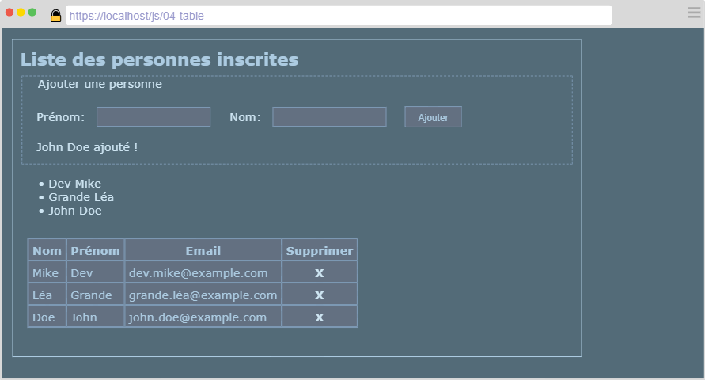

---
title: "Manipuler un tableau"
serie: "frontend"
order: 6
--- 

Soit le tableau suivant :

```js
const people = ['Mike Dev', 'John Makenzie', 'Léa Grande'];
```

A partir de ce tableau de données, vous devez créer une page web permettant de lister ces personnes.

# Exercice 1 : Liste les personnes

Créer un document HTML contenant : 
- Un titre de niveau 1
- Une liste non-ordonnée

Implémentez le code nécessaire (html, css et js) afin que votre page respecte la maquette suivante :



A la suite de cette liste, afficher les même personnes dans un tableau. Vous prendrez soin de : 
- Séparer le prénom et le nom
- Générer une adresse email dont le format est le suivant :
    - nom.prenom@example.com



# Exercice 2 : Manipuler la collection

Ajouter une colonne au tableau contenant une croix. Un clic sur la croix supprime la personne correspondante de la liste.

État de la liste après la suppression de "John Makenzie" :



Sous le titre principal, ajouter un formulaire permettant l'ajout d'une nouvelle personne. Vous devez prendre en compte les contraintes suivantes : 

- Le nom et le prénom ne peuvent contenir que des lettres.
- Le nom et le prénom doivent contenir au moins 2 lettres.
- Il ne peut y avoir 2 personnes qui portent à la fois le même nom et prénom.
- Un message de confirmation indique le succès de l'ajout.
- La personne créée est ajoutée à la fin de la liste.


