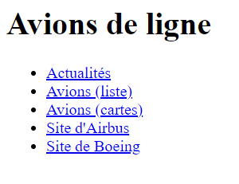
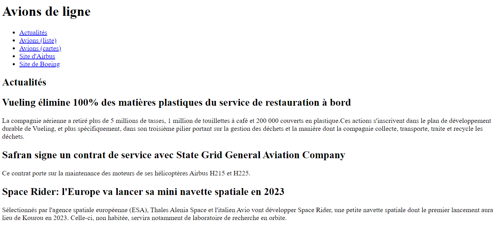
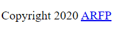
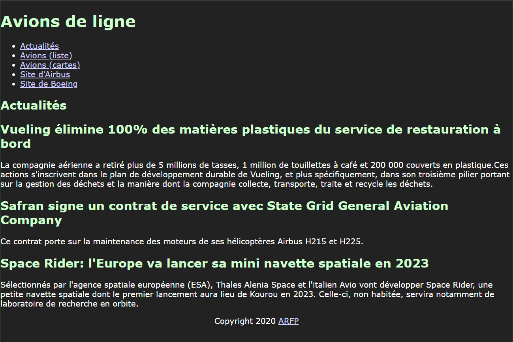
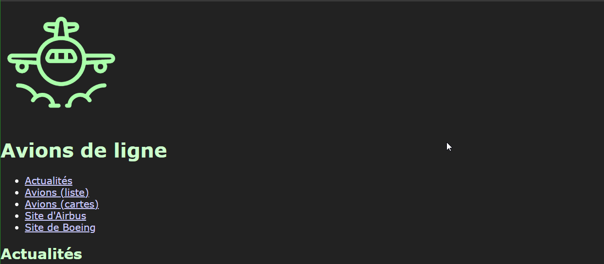
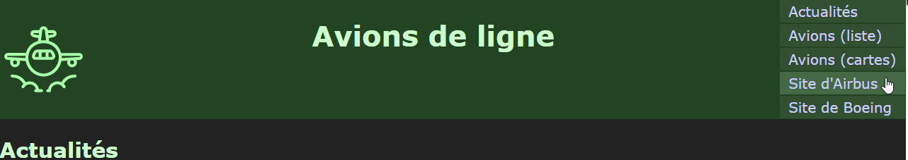
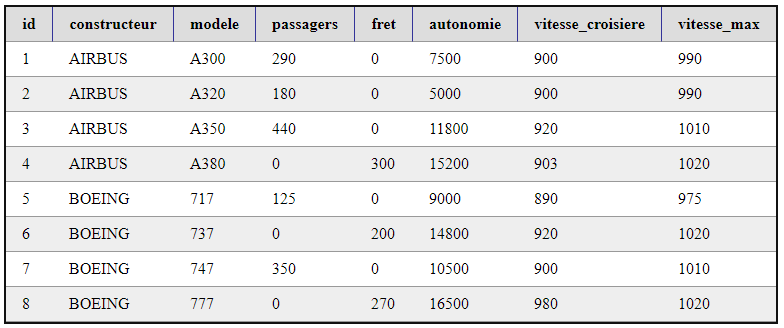
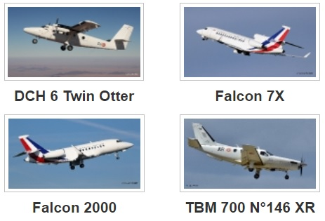

**Reprenons quelque bases...**

Dans cette suite d'exercices, vous allez développer une page web statique qui affichera des actualités sur l'aéronautique.

Commencez par créer un répertoire pour organiser vos fichiers.

**Dans ce répertoire :** 

1. Créez un fichier "index.html"
2. Créez un dossier "assets"
3. Dans le dossier "assets"
    1. Créez un dossier "css"
    2. Créez un dossier "js"
    3. Créez un dossier "img"

**La structure de votre projet doit alors ressembler à ceci :**

- /mondossier/
    - assets/ 
        - css/
        - img/
        - js/
    - index.html

# Exercice 1 : Structure du document HTML

Vous allez devoir mettre en place la structure standard d'une page HTML. 
Le respect de cette structure est indispensable pour que vos documents HTML soient correctement interprétés par les navigateurs et moteurs de recherches.

Ouvrez votre page index.html dans votre éditeur et créez la structure HTML standard.

Votre document HTML doit respecter ces conditions :

- Le type de document (doctype) est défini
- Le jeu de caractères (charset) est défini
- Le titre est défini

**Pour vous aider** 

- https://developer.mozilla.org/fr/docs/Web/HTML/Introduction_to_HTML5 
- https://developer.mozilla.org/en-US/docs/Learn/HTML/Introduction_to_HTML/The_head_metadata_in_HTML
- https://developer.mozilla.org/fr/docs/Web/HTML/Element/meta 

## Entête de la page

Vous l'avez remarqué, HTML n'est pas un langage de programmation, c'est un langage de balisage qui vous permet de structurer et hiérarchiser du contenu. 
Les informations de la page sont ajoutées dans la balise `<head>`. Le contenu est quant à lui ajouté dans la balise `<body>`. C'est à l'intérieur de cette balise que se trouvera le "contenu utile" (le contenu affiché dans le navigateur).

La sémantique est très importante sur les pages web. Les balises `<nav> <header> <main> <section> <article> <aside> <footer>` permettent de définir des "blocs" de contenu et leur place dans la hiérarchie du document.

Complétez le fichier index.html : 

1. Dans la balise `<body>`, ajoutez une balise `<header>` 
2. Dans cette balise `<header>`
    1. ajoutez un titre de niveau 1
    2. ajouter un menu dans une balise `<nav>`

Une fois terminé, ouvrez votre fichier index.html dans votre navigateur web.

Votre page doit ressembler à ceci :

- Les 3 premiers liens du menu sont inactifs pour le moment.
- Le lien "Site d'Airbus" pointe sur https://airbus.com 
- Le lien "Site de Boeing" pointe sur https://boeing.fr

**Pour vous aider** 

- https://developer.mozilla.org/fr/docs/Web/HTML/Element/header 
- https://developer.mozilla.org/fr/docs/Web/HTML/Element/Heading_Elements 
- https://developer.mozilla.org/fr/docs/Web/HTML/Element/nav 
- https://developer.mozilla.org/en-US/docs/Learn/HTML/Introduction_to_HTML/HTML_text_fundamentals  
- https://developer.mozilla.org/en-US/docs/Learn/HTML/Introduction_to_HTML/Creating_hyperlinks 

## Contenu principal

Dans un document HTML5, le contenu principal est situé dans la balise `<main>` qui est unique dans le document.

Après la balise `<header>`, ajoutez une balise `<main>`. 

A l'intérieur de cette balise, créez une section "Actualités" et ajoutez-y [les 3 articles de ce fichier texte](./img/plane02_actualites.txt).

Rendu de la page attendu: 

**Pour vous aider** 

- https://developer.mozilla.org/en-US/docs/Web/HTML/Element/main  
- https://developer.mozilla.org/en-US/docs/Web/Guide/HTML/Using_HTML_sections_and_outlines 

## Pied de page

Après la fermeture de la balise `</main>`, ajoutez une balise `<footer>` qui contiendra les éléments suivants :

- Une mention "Copyright"
- Un lien http://www.arfp.asso.fr 

**Pour vous aider** 

- https://developer.mozilla.org/en-US/docs/Web/HTML/Element/footer 

> Valider votre travail avec vos formateurs avant de passer à la suite.

# Exercice 2 : Mise en forme 

HTML permet de définir la structure d'un document.
Le langage CSS est quant à lui utilisé pour mettre en forme le contenu (positionner le contenu, ajouter des couleurs etc....) d'une page HTML.

- https://developer.mozilla.org/en-US/docs/Web/Tutorials#CSS_Tutorials 

## Lier une feuille de style

Dans le répertoire `assets/css/`, créez un fichier `main.css`.
Liez ensuite ce fichier à votre document HTML.

**Pour vous aider**

- https://developer.mozilla.org/en-US/docs/Web/HTML/Element/link 

## Le langage CSS

Les Feuilles de Styles en Cascade (CSS) existent depuis les débuts du web.
CSS permet de définir des "règles" d'affichage à des éléments précis d'un document XML ou HTML.

Dans le fichier `assets/css/main.css`, créez les règles CSS afin que la page index.html respecte les conditions suivantes :

- La couleur de fond de la page est #222222 
- La couleur du texte est #FFFFFF 
- La couleur des titres est #CCFFCC
- La couleur des liens est #CCCCFF
- Le texte utilise la police de caractères "Verdana"
- Il ne doit y avoir aucune marge entre les bords de la fenêtre et le contenu
- Le contenu du footer est centré horizontalement

Le rendu de votre page doit alors être celui-ci :

**Pour vous aider** 

Effectuez les recherches suivantes sur le web: 

- [CSS selectors](https://www.google.fr/search?q=css+selectors)
- [CSS text color](https://www.google.fr/search?q=css+text+color)
- [CSS text font](https://www.google.fr/search?q=css+text-font)
- [CSS margin padding](https://www.google.fr/search?q=css+margin+padding)

## Ajouter le logo

Ajoutez l'image `assets/planes/planes_logo.svg` à votre document HTML. L'image doit être affichée avec une largeur fixe de 100px.

Déterminez où placer l'élément à partir de la capture suivante :

## Mettre en forme l'entête de page

Avant de poursuivre, prenez le temps de vous documenter sur: 
- [le modèle des "boites CSS"](https://www.pierre-giraud.com/html-css-apprendre-coder-cours/block-inline/).
- [Les techniques de mise en page CSS](https://developer.mozilla.org/fr/docs/Apprendre/CSS/CSS_layout/Introduction)

Ajoutez les règles CSS suivantes à l'entête de page :

- display: flex
- couleur de fond: #224422

Observez le résultat.

Ajoutez ensuite les règles CSS nécessaires pour obtenir le résultat suivant :

Pour vous aider : [Guide Flexbox](https://css-tricks.com/snippets/css/a-guide-to-flexbox/)

## Mettre en page la totalité du document

Avec ces bases, vous devriez pouvoir terminer la mise en page de ce document HTML.

Proposez une mise en page pour les actualités en respectant le style défini jusqu'ici.

> Valider votre travail avec vos formateurs avant de passer à la suite.

# Exercice 3 : Afficher la liste des avions

A la suite des actualités et en respectant le style graphique utilisé jusqu'à présent, affichez un tire de niveau 2 "Liste d'avions" suivi des avions de la liste suivante sous forme de tableau : 

 

## Ajouter une gallerie

A la suite du tableau, ajoutez un titre de niveau 2 "Gallerie d'images" suivi d'une gallerie d'image contenant l'image de chaque avion.

Exemple de gallerie : 

Chaque image doit s'afficher avec les dimensions suivantes : `230px * 150px`. 

Liste des images : 

- [Airbus A300](./img/airbus-a300.jpg)
- [Airbus A320](./img/airbus-a320.jpg)
- [Airbus A350](./img/airbus-a350.jpg)
- [Airbus A380](./img/airbus-a380.jpg)
- [Boeing 717](./img/boeing-717.jpg)
- [Boeing 737](./img/boeing-737.jpg)
- [Boeing 747](./img/boeing-747.jpg)
- [Boeing 777](./img/boeing-777.jpg)

## Finalisation

Éditez les 3 premiers liens du menu. Chacun d'entre eux envoie l'utilisateur à la section correspondante de la page.

> Valider votre travail avec vos formateurs avant de passer à la suite.
