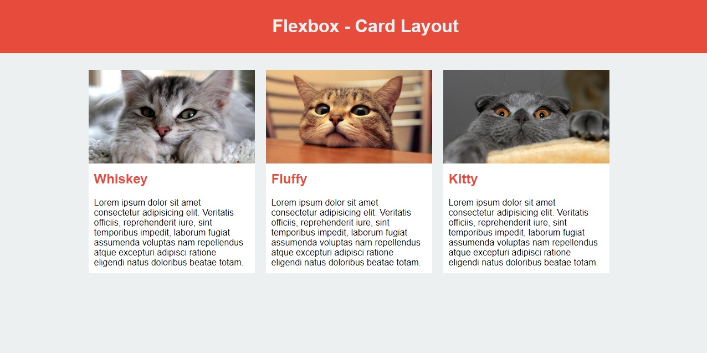
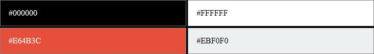

Réalisez la page HTML correspondant à la maquette et à la description ci-dessous.

Utilisez FLEXBOX pour positionner les éléments.

## CATS

### Couleurs : 

### Informations 
La police d'écriture utilisée est "Arial".

Les images sont accessibles en cliquant sur les liens suivants : [cat1.jpg](img/cat1.jpg), [cat2.jpg](img/cat2.jpg), [cat3.jpg](img/cat3.jpg).

