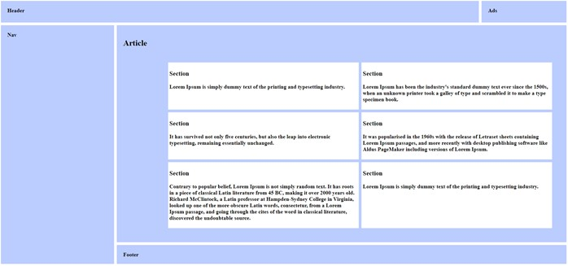

Soit le corps HTML suivant : 

```html
<body>
    <header>
        <h1>Header</h1>
        <aside>Ads</aside>
    </header>
    <nav>
        <h2>Nav</h2>
    </nav>
    <main>
        <article class="principal">
            <h2>Article</h2>
            <section>
                <h3>Section</h3>
                <p>Lorem Ipsum...</p>
            </section>
            <section>
                <h3>Section</h3>
                <p>Lorem Ipsum...</p>
            </section>
            <section>
                <h3>Section</h3>
                <p>Lorem Ipsum...</p>
            </section>
            <section>
                <h3>Section</h3>
                <p>Lorem Ipsum...</p>
            </section>
            <section>
                <h3>Section</h3>
                <p>Lorem Ipsum...</p>
            </section>
            <section>
                <h3>Section</h3>
                <p>Lorem Ipsum...</p>
            </section>
        </article>
    </main>
    <footer>
        <p>Footer</p>
    </footer>
</body>
```

1. Créez un document HTML et insérer le code ci-dessus sans le modifier.
2. Réalisez mise en forme CSS correspondant à la maquette suivante :



Utilisez GRID pour positionner les éléments en `bleu`.

Utilisez FLEXBOX pour positionner les éléments en `blanc`.

L'ensemble doit occuper tout l'espace disponible.

Couleurs : 
-	Bleu : #BBCCFF

Bonus : Proposez une version « mobile » à 1 colonne.
