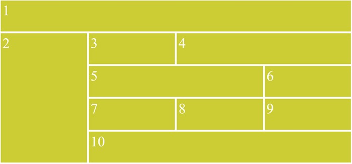

Soit le corps HTML suivant : 

```html
<main class="principal">
    <section id="s1">1</section>
    <section id="s2">2</section>
    <section id="s3">3</section>
    <section id="s4">4</section>
    <section id="s5">5</section>
    <section id="s6">6</section>
    <section id="s7">7</section>
    <section id="s8">8</section>
    <section id="s9">9</section>
    <section id="s10">10</section>
</main>
```

1. Créez un document HTML et insérer le code ci-dessus sans le modifier.
2. Réalisez mise en forme CSS correspondant à la maquette suivante :



Vous devez créer 2 versions CSS pour la même page : 

1. **Version 1**: Uniquement GRID pour positionner les éléments
2. **Version 2**: GRID + FLEXBOX pour positionner les éléments

L'ensemble doit occuper tout l'espace disponible.

Couleurs : 
-	Jaune/Vert : #CCCC33
