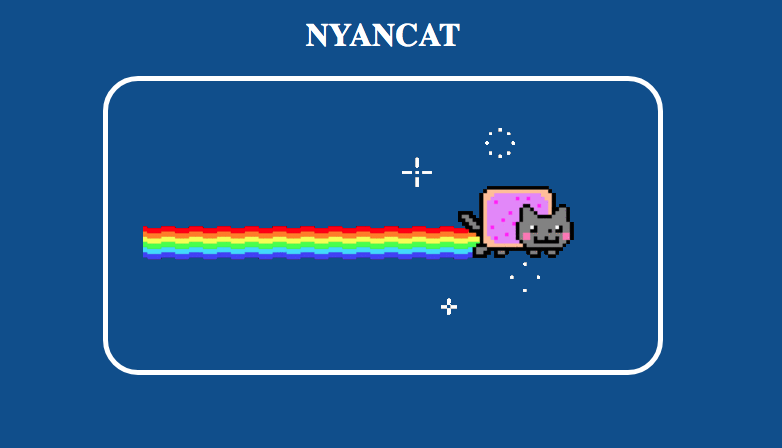
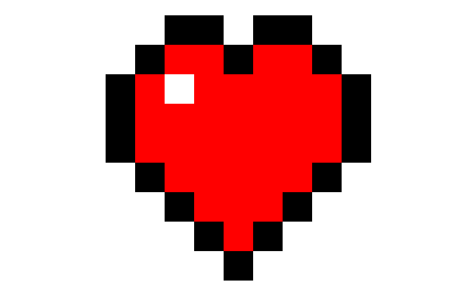
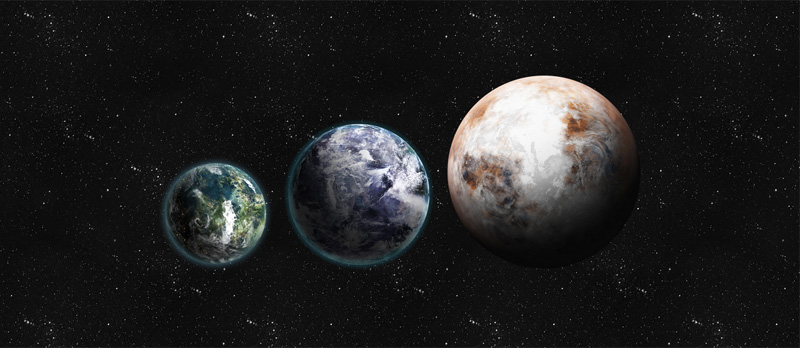
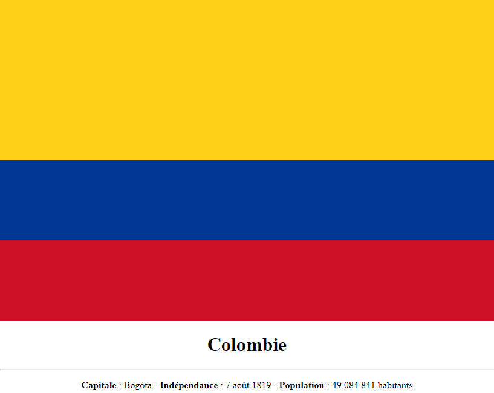
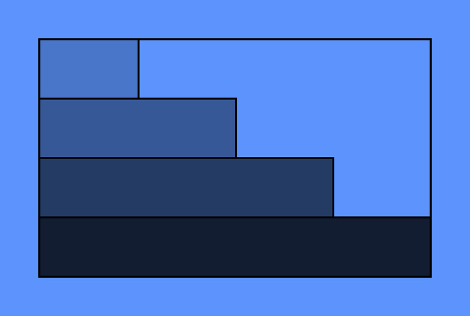
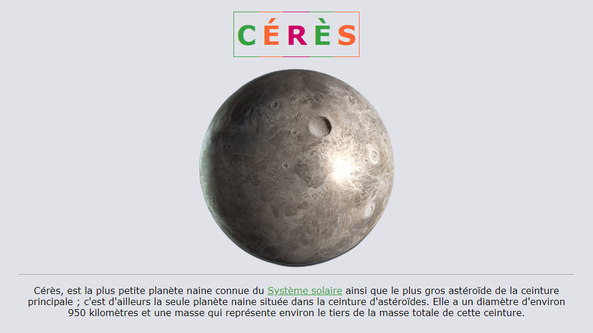
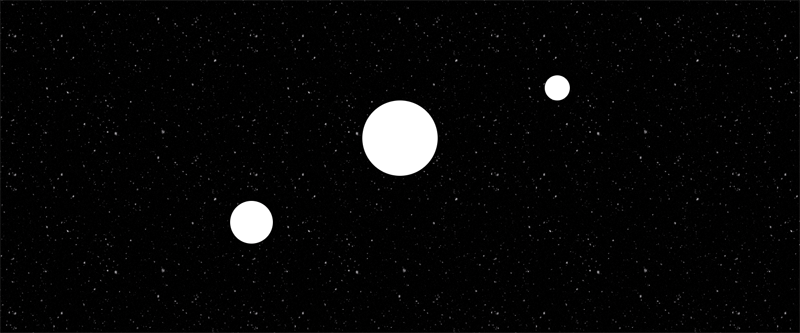
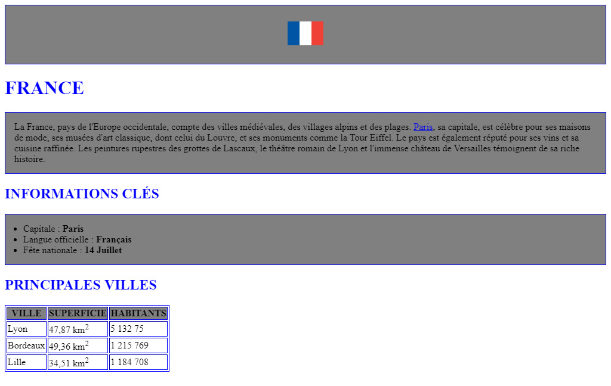
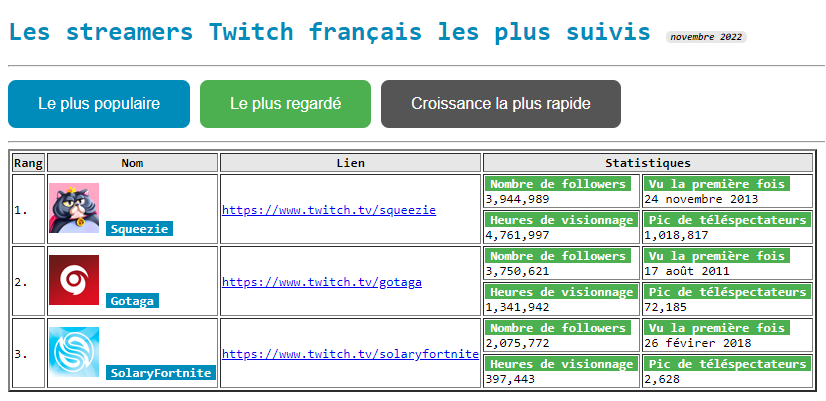

---
title: "Mini pages"
serie: "positionnement"
order: 14
--- 

Réalisez les pages HTML correspondant aux maquettes ci-dessous. 

- 1 fichier HTML et 1 fichier CSS par exercice

## Exercice 4.1 : Nyancat

Créer un document `nyancat.html` correspondant à la maquette suivante : 

- [Lien vers l'image](./img/css-exo14-cat.gif)
- Bleu :  #0F4D8F

## Exercice 4.2 : Carrés

Créer un document `squares.html` correspondant à la maquette suivante : 

- [Carré Rouge](./img/red.png)
- [Carré Noir](./img/black.png)
- [Carré Blanc](./img/white.png)

## Exercice 4.3 : Planètes

Créer un document `planets.html` correspondant à la maquette suivante : 

- [Fond étoilé](./img/css-16-bg.webp)
- [Planète 1](./img/planet-1.png)
- [Planète 2](./img/planet-2.png)
- [Planète 3](./img/planet-3.png)

## Exercice 4.4 : Colombie

Créer un document `colombie.html` correspondant à la maquette suivante : 

- Jaune :  #FCD116
- Bleu :  #003893
- Rouge :  #CE1126

## Exercice 4.5 : Barres 

Créer un document `bars.html` correspondant à la maquette suivante : 

- Couleur de fond :  #5C94FC
- Couleur 1 :  #4976C9
- Couleur 2 :  #375897
- Couleur 3 :  #243B64
- Couleur 4 :  #121D32

## Exercice 4.6 : Cérès 

Créer un document `ceres.html` correspondant à la maquette suivante : 

- [Image de Cérès](./img/planet-ceres.png)
- Couleur de fond :  #E0E2E8
- Vert :  #36A23E
- Orange :  #FF6633
- Fushia :  #CC0066
- Police: Verdana

## Exercice 4.7 : Espace 

Créer un document `space.html` correspondant à la maquette suivante : 

- [Image](./img/snow-black.gif)

## Exercice 4.8 : France 

Créer un document `france.html` correspondant à la maquette suivante : 

- [Image](./img/css-flag.png)
- Couleur bleu :  blue
- Couleur gris :  grey

## Exercice 4.9 : Twitch 

Créer un document `twitch.html` correspondant à la maquette suivante : 

- [Image Squeezie](./img/html-squeezie.png)
- [Image SolaryFornite](./img/html-solary.png)
- [Image Gotaga](./img/html-gotaga.png)
- Couleur bleu :  #008CBA
- Couleur gris :  #555555
- Couleur verte :  #4CAF50
- Police : monospace
