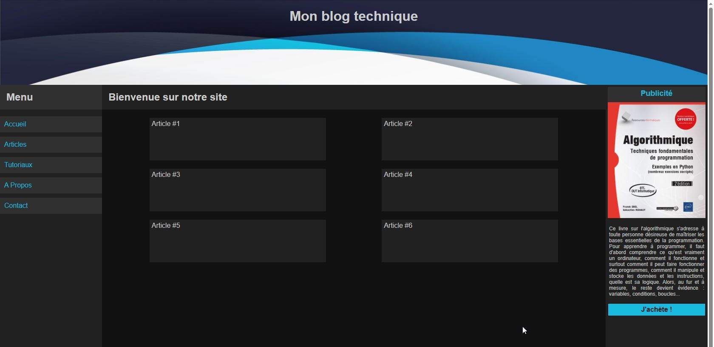
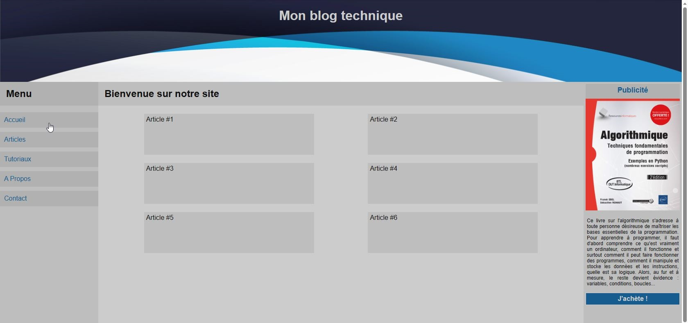
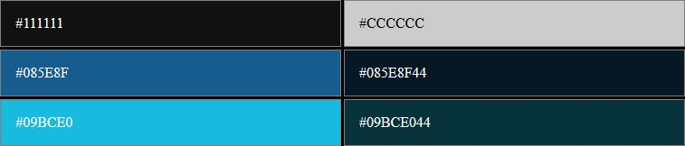

Réalisez la page HTML correspondant à la description ci-dessous.

Utilisez FLEXBOX et GRID pour positionner les éléments.
 

## Basic Template

### Mode sombre 

### Mode clair 

L'affichage doit respecter le choix de l'utilisateur (mode clair ou sombre). 

Au chargement de la page, la version correspondant au choix de l'utilisateur est affichée. 

Ceci est réalisé grâce à *prefers-color-scheme* du langage CSS. 

Documentez-vous sur le site MDN : [prefers-color-scheme](https://developer.mozilla.org/en-US/docs/Web/CSS/@media/prefers-color-scheme).

### Couleurs : 

### Informations :

La police d'écriture utilisée est "Arial"

- Hauteur de l'entête : 200px.
- Largeur des 2 blocs latéraux : 240px.
- La partie centrale occupe tout l'espace disponible.

Les images : 
- La bannière : [basic-template-banner.png](img/basic-template-banner.png)
- La publicité : [basic-template-aside.jpg](img/basic-template-aside.jpg)

**Bonus :** Proposez une version « mobile » à 1 colonne.

> Valider votre travail avec un formateur avant de passer à la suite

Lorsque vous avez terminé et validé votre travail, vous pouvez passer à l'exercice suivant : [Publier un site sur GitHub](../ci-cd/11-cv/)
