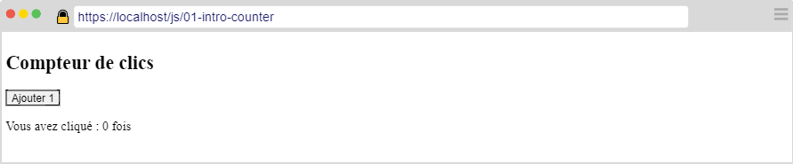
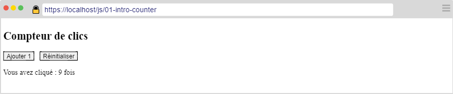

---
title: "Introduction #1"
serie: "frontend"
order: 1
--- 

L'objectif de cet exercice est de vous familiariser avec JS et la manipulation du DOM.

## Exercice 1 : Compteur de clics

Créer un document HTML contenant : 

- 1 titre de niveau 1 
- 1 bouton  
- Un paragraphe

Votre page devrait ressembler à la capture suivante : 

Au clic sur le bouton, le compteur dans le paragraphe s'incrémente de 1.

Par exemple, après 3 clics sur le bouton : 

 

Ajouter ensuite un second bouton libellé "Réinitialiser". 

 

Un clic sur ce second bouton réinitialise le compteur à 0.
