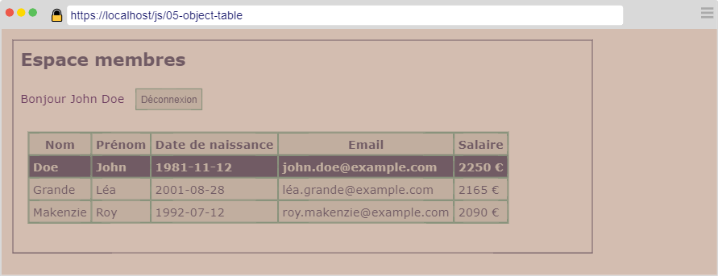

---
title: "Tableau d'objets"
serie: "frontend"
order: 8
--- 

Soit le document JSON suivant :

```js
[
    {
        "id": 1,
        "lastname": "Doe",
        "firstname": "John",
        "birthday": "1981-11-12",
        "salary": 2250,
        "password": "1234"
    },
    {
        "id": 2,
        "lastname": "Grande",
        "firstname": "Léa",
        "birthday": "2001-08-28",
        "salary": 2165,
        "password": "123456"
    },
    {
        "id": 3,
        "lastname": "Makenzie",
        "firstname": "Roy",
        "birthday": "1992-07-12",
        "salary": 2090,
        "password": "azerty"
    }
]
```
Ce document contient 3 utilisateurs.

> Dans les règles de sécurité, les mots de passe doivent obligatoirement être chiffrés. Dans le cadre de cet exercice, les mots de passe sont volontairement stockés en clair. Vous aborderez le chiffrement des mots de passe dans les modules suivants.

A partir de ce document JSON, vous devez créer une page web permettant d'identifier un utilisateur.

# Étape 1 : Identification

Créer un document HTML contenant : 
- Un titre de niveau 1
- Un formulaire d'identification. 

Implémentez le code nécessaire (html, css et js) afin que votre page respecte la maquette suivante :


L'identifiant est la concaténation du nom et du prénom séparés par un point. Par exemple, pour l'utilisateur `John Doe`, l'identifiant est `john.doe`.

# Étape 2 : Gérer l'erreur d'identification

En cas d'erreur sur l'identifiant ou le mot de passe, un message d'erreur s'affiche en haut à droite de la page. Ce message disparaît automatiquement au bout de 5 secondes.


# Étape 3 : Identification réussie

Si les informations saisies dans le formulaire sont correctes, l'utilisateur est identifié.

Afficher "Bonjour Prénom Nom" suivi d'un bouton permettant à l'utilisateur de se déconnecter. 

Au clic sur le bouton de déconnexion, l'utilisateur est redirigé sur le formulaire d'identification.

La liste de tous les utilisateurs s'affiche à la suite, dans un tableau.

- Le nom
- Le prénom
- La date de naissance
- L'adresse email (générée à partir du nom et prénom)
- Le salaire exprimé en €

L'utilisateur identifié apparaît en surbrillance dans le tableau.



Attention : Les mots de passe ne doivent pas être affichés ! 
