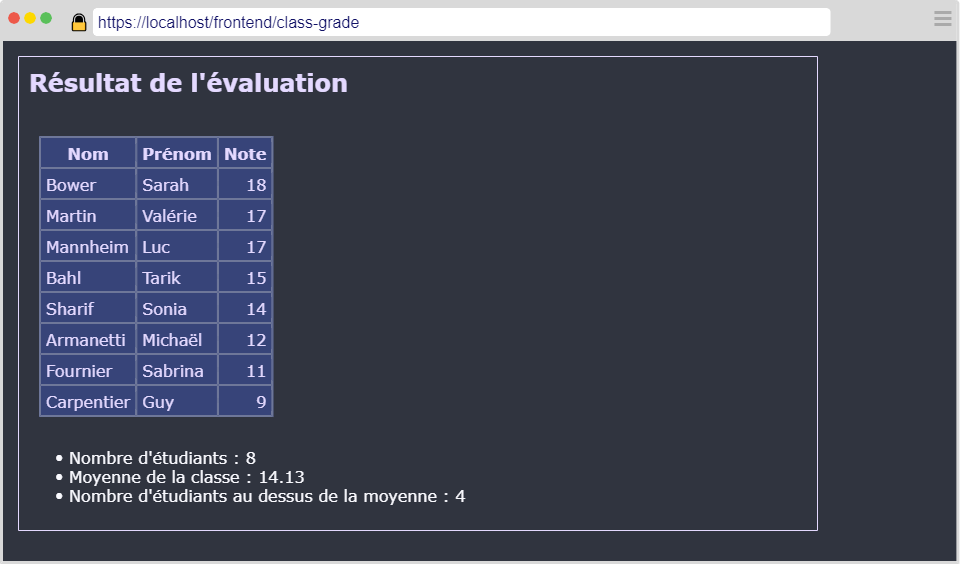
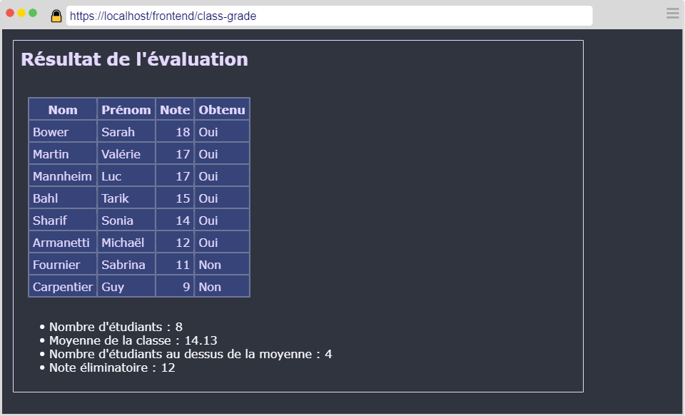
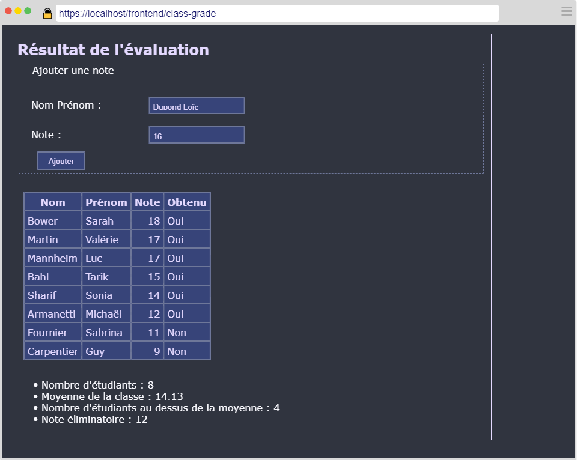

---
title: "L'évaluation"
serie: "js2"
order: 1
--- 
<style>
    h1 { 
    page-break-before: always;
  }
    </style>
Soit le fichier JSON suivant : 

```js 
[
    { "fullname": "Armanetti Michaël", "grade": 12 },
    { "fullname": "Bahl Tarik", "grade": 15 },
    { "fullname": "Bower Sarah", "grade": 18 },
    { "fullname": "Carpentier Guy", "grade": 9 },
    { "fullname": "Fournier Sabrina", "grade": 11 },
    { "fullname": "Mannheim Luc", "grade": 17  },
    { "fullname": "Martin Valérie", "grade": 17 },
    { "fullname": "Sharif Sonia", "grade": 14 }
]
```

Cette collection contient une liste d'étudiants ayant passé une évaluation.

Votre travail consiste à développer une petite application de gestion des notes obtenues.

1. Créer un répertoire pour votre projet.
2. Créer un fichier **index.html** et y insérer la structure HTML standard.
3. Copier le code JSON ci-dessus et insérer le dans un fichier **eval.json**
4. Implémentez le code HTML, Javascript et CSS correspondant à la description ci-dessous.

**Couleurs à utiliser :**
```css 
:root {
    --color1: #30343F;
    --color2: #FAFAFF;
    --color3: #E4D9FF;
    --color4: #374479;
    --color5: #6E7799;
    --color6: #C490D1;
}
```

# Étape 1

Au démarrage, l'application charge les données JSON et les affiche sous forme de tableau.
Les données sont triées par note de la plus élevée à la plus basse.

A la suite du tableau, ajouter dans cet ordre : 
- Le nombre d'étudiants affichés dans le tableau
- La note moyenne 
- Le nombre d'étudiants au dessus de la moyenne



# Étape 2

L'évaluation prévoit une note élminatoire fixée à 12/20. Les étudiants sous cette note ont échoué à l'évaluation.

1. Ajouter cette information en bas de page.
2. Ajouter au tableau, une colonne indiquant si l'étudiant a obtenu ou non l'évaluation.



# Étape 3

Sous le titre principal, Ajouter un formulaire permettant à l'évaluateur d'ajouter un étudiant à la liste.



# Contrôles de saisie 

L'étudiant ajouté apparaît dans le tableau. Les statistiques sous le tableau doivent toujours correspondre à l'état actuel du tableau.


Vous vous devez de vérifier les données saisies :
- Le nom contient au minimum 2 lettres
- Le prénom contient au minimum 2 lettres
- La note doit être comprise entre 0 et 20

Le champ "Nom Prénom" doit être insensible à la casse. Vous prendrez soin de formatter le nom et prénom (un nom commence par une majuscule suivie de minuscules. Idem pour le prénom).
