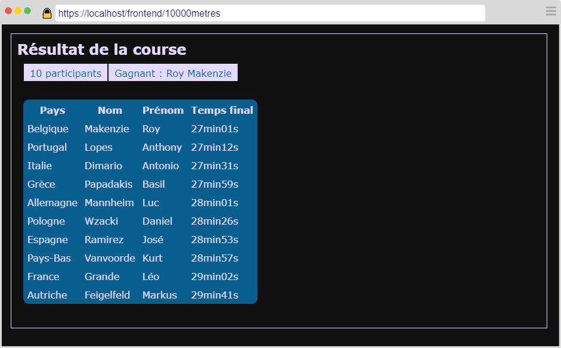
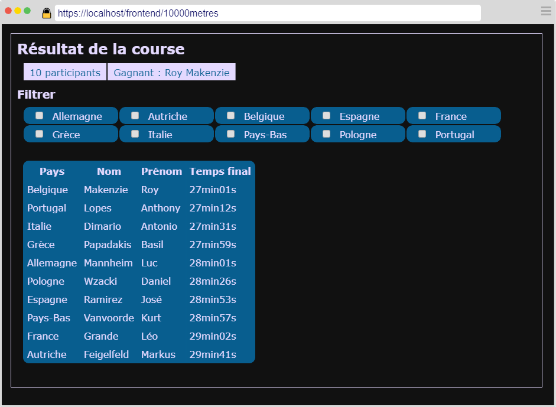
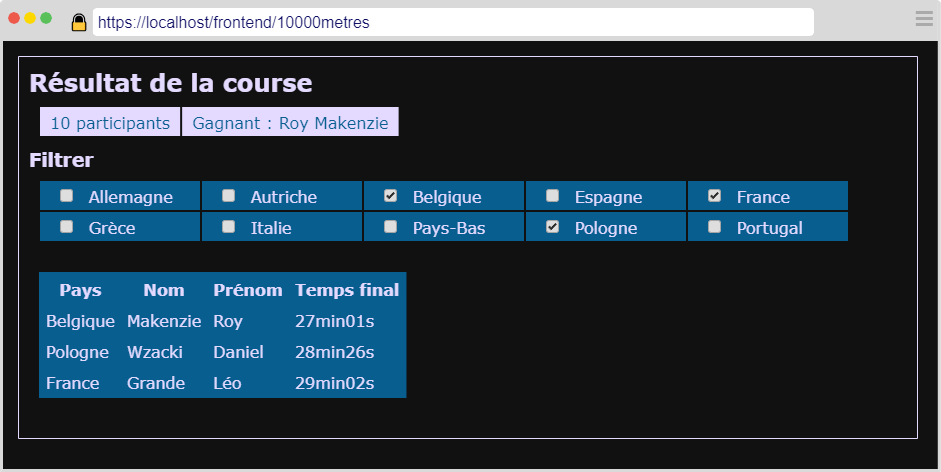
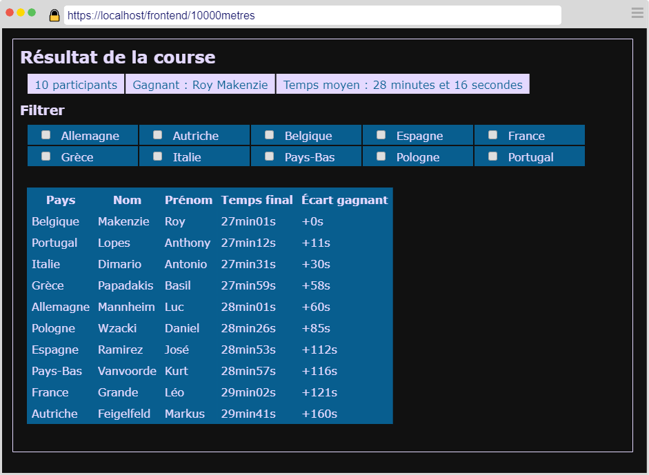

---
title: "Course à pied"
serie: "js2"
order: 2
--- 
<style>
    h1 { 
    page-break-before: always;
  }
    </style>

Vous avez la mission de développer un logiciel de visualisation de résultats des épreuves du 10000 mètres à pied.

On vous fournit un document JSON contenant le résultat d'une épreuve du 10000 mètres. 

```js 
[
    { "nom": "Grande Léo", "pays": "France", "temps": 1742 },
    { "nom": "Makenzie Roy", "pays": "Belgique", "temps": 1621 },
    { "nom": "Mannheim Luc", "pays": "Allemagne", "temps": 1681 },
    { "nom": "Vanvoorde Kurt", "pays": "Pays-Bas", "temps": 1737 },
    { "nom": "Dimario Antonio", "pays": "Italie", "temps": 1651 },
    { "nom": "Ramirez José", "pays": "Espagne", "temps": 1733 },
    { "nom": "Lopes Anthony", "pays": "Portugal", "temps": 1632 },
    { "nom": "Wzacki Daniel", "pays": "Pologne", "temps": 1706 },
    { "nom": "Papadakis Basil", "pays": "Grèce", "temps": 1679 },
    { "nom": "Feigelfeld Markus", "pays": "Autriche", "temps": 1781 }
]
```

> Le temps correspond au score du participant et est exprimé en secondes. Le gagnant de la course est le participant ayant réalisé le temps le plus petit.

1. Créer un répertoire pour votre projet.
2. Créer un fichier **index.html** et y insérer la structure HTML standard.
3. Copier le code JSON ci-dessus et insérer le dans un fichier **resultat10000metres.json**
4. Implémentez le code nécessaire aux fonctionnalités et captures présentées ci-après.

**Couleurs à utiliser :**
```css 
:root {
    --base-bg: #111111;
    --base-txt: #CCCCCC;
    --base-link: #E4D9FF;
    --base-btn: #085E8F;
}
```

# Étape 1

Au démarrage, l'application charge les données JSON et les affiche sous forme de tableau.
Les données sont triées par **temps** du plus petit au plus grand.

Le tableau est précédé des informations suivantes : 
- Le nombre de participants de la course
- Le nom du gagnant



# Étape 2

Ajouter une section permettant de filtrer l'affichage par pays.



Uniquement les participants des pays sélectionnés d'affichent.



Si aucune case n'est cochée, tous les participants sont affichés.

# Étape 3

Pour terminer, ajouter :
- Le temps moyen de la course
- L'écart de temps de chaque participant par rapport au gagnant


