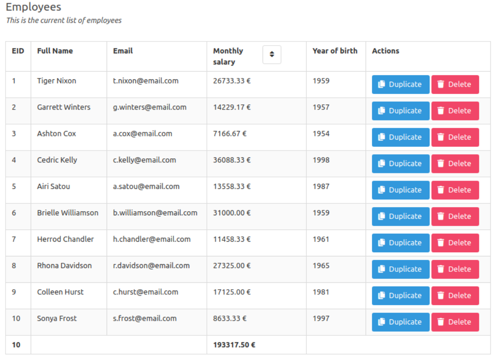

## Afficher une liste d'employés

Pour cet exercice, vous devez créer une application web affichant la liste des employés d'une société. 
Les informations proviennent d'une API fictive et sont rendues disponibles dans le fichier JSON [employees.json](employees.json).

Les employés doivent être listés dans un tableau, avec les informations suivantes :

- ID (fourni par l'API)
- Full name (fourni par l'API)
- Email : (à calculer) Exemple pour John Doe => "j.doe@email.com"
- Salaire mensuel : (à calculer)
- Year of birth : (à calculer)
- Une colonne d'actions contenant des boutons d'actions (voir la capture ci-dessous)
- Le décompte des employés est affiché en-pied de la colonne `ID`.
- Le total des salaires mensuels est affiché en-pied de la colonne Salaire mensuel.
- Un bouton d'action permet de dupliquer un employé dans le tableau.
    - Note: L'ID de l'employé dupliqué doit être redéfini (les identifiants sont uniques)
- Un bouton d'action permet de supprimer un employé du tableau.
- Pour ces boutons d'actions, ne manipulez que les données du JSON chargé.
- Un bouton de tri dans l'en-tête de colonne `Monthly salary` permet le tri croissant / décroissant des valeurs de cette colonne.

Si aucun employé n'est dans la liste, un message signale l'absence d'informations dans le tableau.

L’affichage « en anglais » devrait ressembler à la capture suivante :

> Validez le fonctionnement de votre application avec votre formateur.