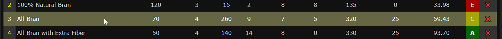
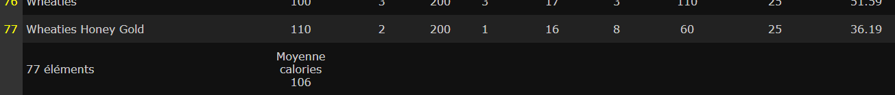
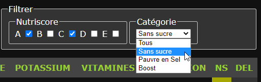

## Les céréales du petit-déjeuner

Pour cet exercice, vous devez créer une application web de gestion d'une liste des céréales du petit-déjeuner. 

Vous devez créer cette aplication avec VueJS.

Les informations proviennent d'une API fictive et sont disponibles à travers une API REST disponible en cliquant sur ce lien : [cereals.json](cereals.json).

L'API retourne une collection de céréales avec les informations suivantes :

ID | Name | Calories | Protéïnes | Sel | Fibres | Glucides | Sucre | Potassium | Vitamines | Évaluation

Note: Une valeur égale à "-1" signifie que la donnée n'est pas disponible pour ce céréale.

---

# Version 1

## Création de l'interface utilisateur

- Les informations des céréales doivent apparaitre dans un tableau.
- L'entête de la page contient le titre, un champ de recherche et des filtres de recherche.
- Les entêtes des colonnes permettent le tri croissant / décroissant des valeurs de ces colonnes.

#### Ligne de tableau survolée :

## Couleurs

## Colonne "NutriScore" (NS)

Le nutri-score (de A à E) est calculé selon l'évaluation :

- A: Plus de 80%
- B: Entre 70% et 80%
- C: Entre 55% et 70%
- D: Entre 35% et 55%
- E: Moins de 35%

## Colonne "DEL"

La croix rouge permet de supprimer un céréale de l'affichage. Les éléments supprimés ne sont plus disponibles tant que la page n'est pas rechargée. 

### Éléments supplémentaires

Vous ajouterez également au tableau :

- Le décompte du nombre de céréales affiché en-pied de la colonne Name.
- La moyenne des calories affichée en-pied de la colonne Calories.

### Filtres et Recherche

L'application proposera des fonctionnalités de recherche en temps réel:

- Un champ de recherche pour rechercher un céréale par son nom

- Une recherche multi-critères permettant d'afficher :
    - les céréales ayant un ou plusieurs nutri-score(s) particulier(s) (A,B,C,D ou E)
    - ET
    - les céréales "sans sucre" (taux de sucre inférieur à 1)
    - OU
    - les céréales pauvres en sel (taux de sel inférieur à 50)
    - OU
    - les céréales "boost" (taux de vitamines supérieur ou égal à 25 + taux de fibres supérieur ou égal à 10)

## Fonctionnement de la V1

1. Au chargement, l'application télécharge les données via l'api.
2. Les données sont affichées dans le tableau HTML.
3. L'utilisateur peut utiliser la recherche, les filtres et les boutons de suppression.
 

> Validez le fonctionnement de la V1 avec votre formateur avant de passer à la suite.

---

# Version 2

## Ajout des fonctionnalités de sauvegarde 

Proposer à l'utilisateur :

- la possibilité de sauvegarder l'état actuel du tableau dans le navigateur de l'utilisateur en utilisant l'api LocalStorage de Javascript. Si une sauvegarde existe, demander confirmation.
    - JS LocalStorage : [https://developer.mozilla.org/fr/docs/Web/API/Window/localStorage](https://developer.mozilla.org/fr/docs/Web/API/Window/localStorage)

- La possibilité de télécharger un fichier json correspondant à l'état actuel du tableau de données.

## Fonctionnement de la V2

1. Au chargement, 
    - Si des données ont été sauvegardées, charger ces données.
    - Sinon, l'application télécharge les données via l'api.
2. Les données sont affichées dans le tableau HTML.
3. L'utilisateur peut :
    - Utiliser la recherche, les filtres et les boutons de suppression.
    - Réinitialiser les données (suppression de la sauvegarde et rechargemement complet via l'api).

> Validez le fonctionnement de la V2 avec votre formateur.

---