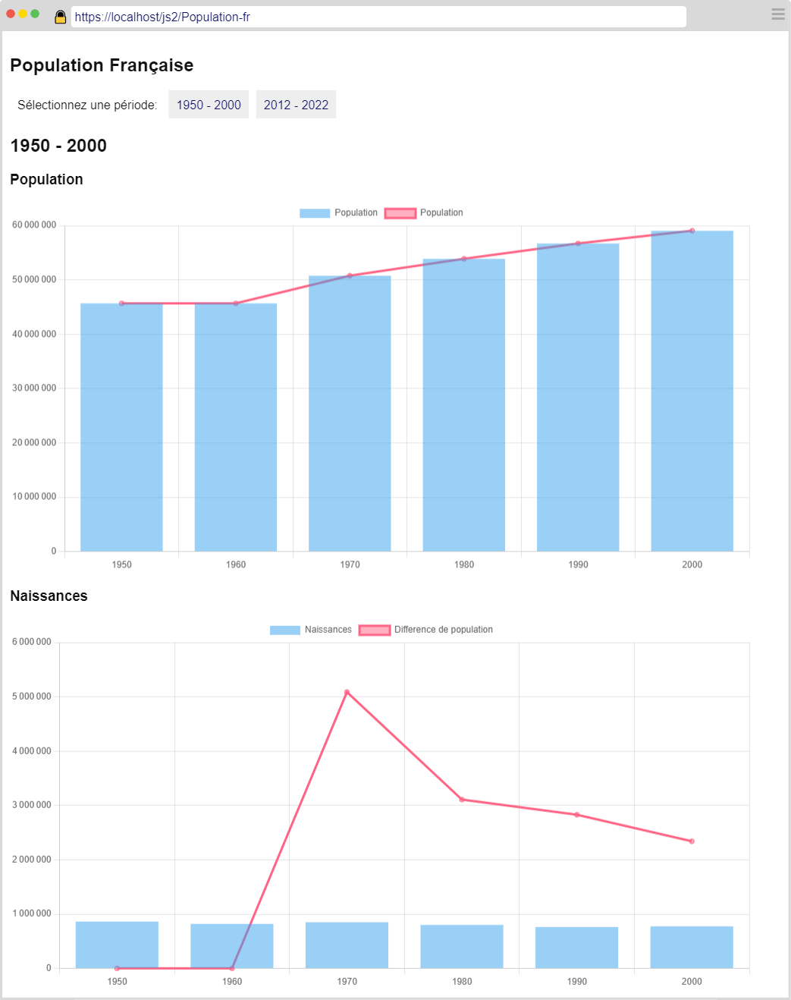
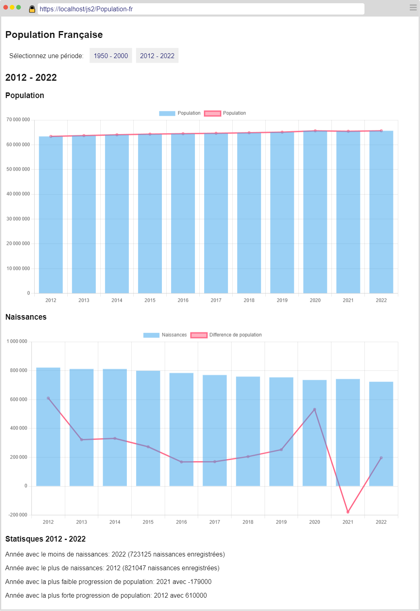

# Les statistiques de population 

Dans cet exercice, vous allez développer une application présentant des statistiques de population (progression, nombre de naissances...).

L'objectif ici est double : 
1. Apprendre à utiliser une bibliothèque externe
2. Apprendre à extraire et organiser des données

# Travail à réaliser 

A partir de données disponibles dans le fichier JSON [fr_population.json](./fr_population.json), vous devez implémenter des diagrammes à l'aide d'une bibliothèque à intégrer à votre projet : [Chart.js](https://www.chartjs.org/docs/latest/getting-started/).

## Les données JSON

Le fichier [fr_population.json](./fr_population.json) contient les informations sur la population et le nombre de naissances pour 2 périodes : **1950 à 2000** et **2012 à 2022**. Pour information, les données présentes dans le fichier sont des données réelles de l'INSEE extraites à partir du site [data.gouv.fr](https://www.data.gouv.fr/fr/).

**Pour la période 1950 à 2000**, vous disposez des statistiques de population par décennie (1950, 1960, 1970, 1980, 1990 et 2000).

**Pour la période 2012 à 2022**, vous disposez des statistiques de population par année.

Ces 2 périodes doivent être gérées séparément.

## Interface utilisateur

L'interface utilisateur implémente les éléments suivants : 

- Un titre de niveau 1
- 2 onglets permettant de basculer entre les 2 périodes
- 2 diagrammes par période 
    - Statistiques de population
    - Statistiques des naissances (nombre de naissances et différence de population par rapport à l'année précédente)

### 1950 - 2000

- Afficher les 2 diagrammes. 

### 2012 - 2022 
- Afficher les 2 diagrammes
- Calculer et afficher des statistiques sous le second diagramme.

> Vous avez la liberté d'utiliser les couleurs de votre choix tant que la mise en page est respectée. Soyez créatif :)
