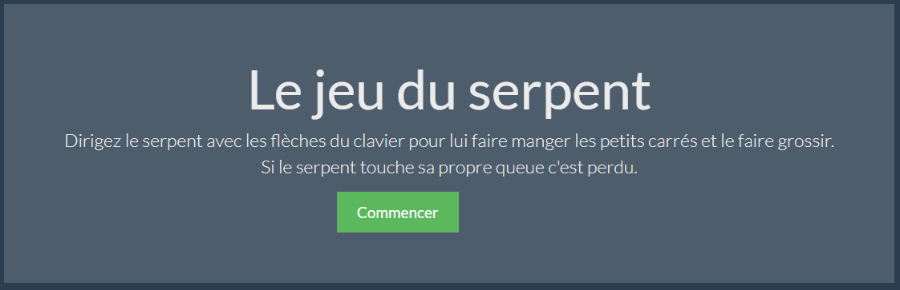
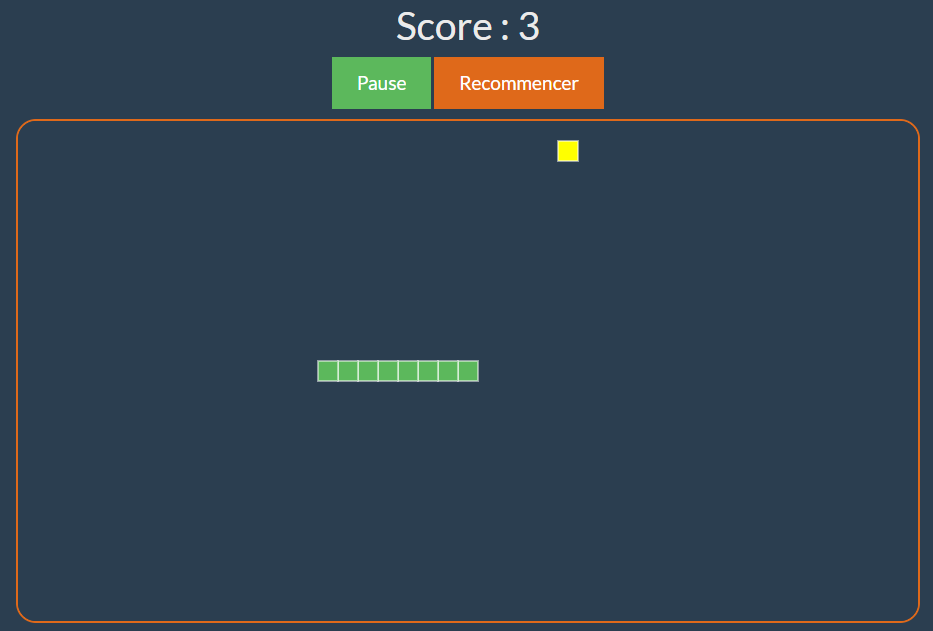

> TP à réaliser avec HTML/CSS/JS et un framework Frontend (VueJS).

Le snake (serpent), est un genre de jeu vidéo dans lequel le joueur dirige un serpent qui grandit et constitue ainsi lui-même un obstacle.

## Fonctionnement du jeu 

Le joueur contrôle une longue et fine ligne semblable à un serpent, qui doit slalomer entre les bords de l'écran et les obstacles qui parsèment le niveau. Pour gagner chacun des niveaux, le joueur doit faire manger à son serpent un certain nombre de pastilles similaire à de la nourriture, allongeant à chaque fois la taille du serpent. Alors que le serpent avance inexorablement, le joueur ne peut que lui indiquer une direction à suivre (en haut, en bas, à gauche, à droite) afin d'éviter que la tête du serpent ne touche les murs ou son propre corps, auquel cas il risque de mourir.

## Fonctionnalités

Comme toujours, avant de nous lancer à l'aveuglette, nous devons définir les fonctionnalités de notre programme, les limites du projet. Il n'est pas question de créer un jeu en 3D ou avec des boutons, des images, une base de données… nous allons faire plus sobre.

**Notre programme devra :**

- s'exécuter dans un navigateur, nous ferons en sorte d'afficher quelques couleurs pour égayer tout ça et surtout rendre notre programme facilement jouable. 

- se jouer en temps réel, pas au tour par tour ! Si le joueur ne touche pas au clavier alors son serpent ira droit dans le mur
- gérer et donc éviter les bogues : serpent faisant demi-tour sur lui-même, sortant de la carte ou dont le corps ne suivrait pas la tête dans certaines configurations
- permettre au joueur de diriger le serpent au clavier à l'aide des touches fléchées

## Exemple d'interface

Au démarrage, le programme affiche une description sommaire du jeu et un bouton pour démarrer une partie.

L'interface d'une partie pourrait ressembler à la capture suivante.

## A vous de jouer

- Référencer les données manipulée par l'application
- Concevez un diagramme de classe correspondant à une partie de jeu
- Implémentez le code correspondant

### A noter

Selon la variante du jeu, lorsque le serpent touche un bord de la zone de jeu ,vous avez 2 choix possible (vous décidez) : 

1. Le serpent touche le bord de la zone de jeu : partie perdue
2. Le serpent touche le bord de la zone de jeu : il réaparrait à l'opposé.

