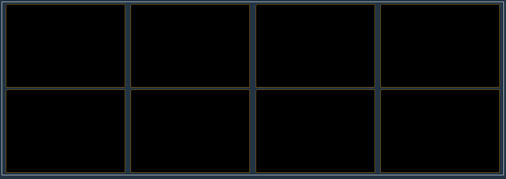
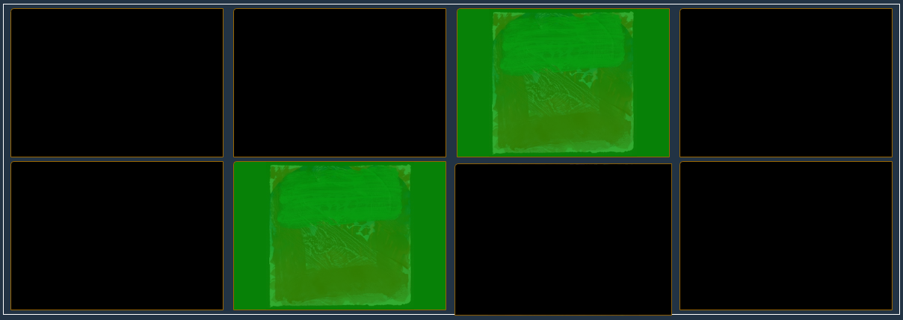
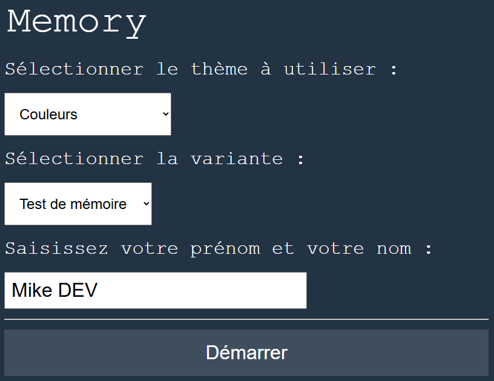

> TP à réaliser avec HTML/CSS/JS et un framework Frontend (VueJS).

**Compétences couvertes :**

- Penser un programme selon des cas d'usage
- Maîtriser l'algorithmie
- Mettre en place un nommage pertinent
- Organiser son code en fonctions
- Utiliser les arguments des fonctions
- Organiser son code de manière cohérente
- Manipuler le DOM
- Utiliser les événements côté client
- Utiliser un framework front-end
- Gérer le temps de jeux

## Contexte 

Le jeu de paires est un jeu de société qui est connu sous différents noms :
- Kai-Awase 
- Pairs et Pelmanism
- Zwillingsspiel
- Punta
- Memory
- Pexeso
- Merkfix

## Fonctionnement du jeu de société

Le jeu se compose de paires de cartes portant des illustrations identiques. L'ensemble des cartes est mélangé, puis étalé face contre table. Le joueur retourne deux cartes de son choix. S'il découvre deux cartes identiques, il les ramasse et les conserve. Si les cartes ne sont pas identiques, il les retourne faces cachées à leur emplacement de départ.

La partie de jeu se termine quand toutes les paires de cartes ont été découvertes et ramassées.

## Fonctionnement de l'application à développer

Le but du jeu est très simple. Au départ toutes les cartes sont cachées, en cliquant sur une carte, sa face avant est affichée, il faut alors retrouver l'autre carte avec la même face. Si l'on se trompe, les deux cartes sont à nouveau masquées. 

Si une paire est découverte, elle reste affichée à l'écran est les cartes correspondantes ne sont plus "jouables".

Lorsque toutes les paires sont découvertes, la partie (le niveau...) est terminée.

Comme toujours, avant de nous lancer à l'aveuglette, nous devons définir les fonctionnalités de notre programme, les limites du projet. Il n'est pas question de créer un jeu en 3D ou avec des boutons, des images, une base de données… nous allons faire plus sobre.

**Notre programme devra :** s'exécuter dans un navigateur, nous ferons en sorte d'afficher quelques couleurs pour égayer tout ça et surtout rendre notre programme facilement jouable. 

Affichez 24 cartes (12 paires) faces cachées sur l'écran, quand le joueur clique sur une carte celle-ci se retourne, quand il clique sur une deuxième carte si elle est identique à la précédente les deux cartes restent face visible autrement les cartes sont à nouveau masquées.

L'objectif est de trouver toutes les paires et que les cartes soient toutes face visible.

**Vous devez développer 2 modes de jeu :**

- Mode "Test de la mémoire"
- Mode "Réapprentissage"

# Consignes

## Écran d'accueil

L'application démarre par un écran d'accueil où l'utilisateur :
- sélectionne un **thème** (couleurs, abstrait, personnages...).
    - Les thèmes sont récupérables sur ce dépôt: [ materials-cards@github](https://github.com/mdevoldere/materials-cards)
- sélectionne une **variante**  (test de mémoire ou réapprentissage)
- saisit son **prénom** et son **nom** (4 caractères minimum pour l'ensemble)
- Un bouton de validation libellé "Démarrer"

- **Bleu foncé :** `#223344` 
- **Blanc :** `#FFFFFF`
- **Police :** `'Courier New', monospace;`
- **Taille du texte** : `24px` minimum

Au clic sur le bouton de validation

1. les informations renseignées sont sauvegardées dans le `sessionStorage` du navigateur.
2. l'interface du jeu s'affiche...

## Écran du jeu

### Entête (header) de l'interface utilisateur 

- Titre de niveau 1 contenant le nom de l'application
- Le prénom et nom renseignés sur l'écran d'accueil
- La variante utilisée
- Un compteur de temps qui démarre au 1er click sur une carte
- Un bouton pour mettre le compteur de temps en pause
- Un compteur de "coups" déterminant le score
- Une indication précisant le meilleur score possible (le nombre de coups minimum pour terminer la partie)
- Un bouton pour réinitialiser la partie

L'entête doit utiliser le moins d'espace vertical possible afin de laisser un maximum de place pour le plateau de jeu.

## Mode "Test de la mémoire"

Dans cette variante, 
- La partie est composée de 6 niveaux identiques. 
- Le plateau de jeu contient 12 paires de cartes.

Lorsque l'utilisateur a terminé un niveau, un compteur de 20 secondes se lance et la partie recommence **avec la même configuration** (Les cartes et leur emplacement ne changent pas).

Une fois que l'utilisateur a terminé le 5ème niveau, un ultime niveau est lancée au bout de **20 minutes**, toujours avec la même configuration.

A l'issue de ce dernier niveau, la partie est considérée terminée et le résultat du test est affiché.

**Tableau des niveaux de la variante "Test de mémoire":** 

| Niveau | Nombre de paires de cartes | Pause avant le niveau suivant |
| --- | --- | --- |
| 1 | 12 | 20 secondes |
| 2 | 12 | 20 secondes |
| 3 | 12 | 20 secondes |
| 4 | 12 | 20 secondes |
| 5 | 12 | 20 minutes |
| 6 | 12 | - |

## Mode "Réapprentissage"

Dans cette variante,
- La partie est composée de 7 niveaux progressifs.
- Le plateau de jeu contient 2 paires de cartes au démarrage.

Lorsque l'utilisateur termine un niveau, le résultat du niveau s'affiche et, au bout de 20 secondes, un nouveau plateau est généré avec plus de cartes à découvrir.

**Tableau des niveaux de la variante "Réapprentissage":** 

| Niveau | Nombre de paires de cartes |  
| --- | --- |
| 1 | 2 |
| 2 | 4 |
| 3 | 8 |
| 4 | 12 |
| 5 | 16 |
| 6 | 20 |
| 7 | 28 |

Lorsque l'utilisateur a terminé le dernier niveau, le résultat est affiché.

## Les résultats des tests

A la fin d'une partie, le programme doit afficher et sauvegarder les statistiques de la partie dans le `localStorage` du navigateur : 

**Pour chaque niveau terminé :** 
- Le temps écoulé 
- Le meilleur score possible (en nombre de clics)
- Le nombre de clics total effectués sur chaque carte
- Le nombre d'essais
    - 1 essai = 2 clics (sélection de la 1ère carte et de la seconde)
- Le pourcentage de réussite 
    - `100 - (nombre_essais - meilleur_score_possible) / nombre_essais * 100`

**Pour la partie entière :**
- Le nom et prénom de l'utilisateur renseignés sur l'écran d'accueil
- La date et heure de démarrage de la partie
- Le temps total écoulé
- Le pourcentage de réussite

L'utilisateur a également la possibilité de télécharger le résultat d'une partie via un bouton/lien affiché à la suite des statistiques.

## A vous de jouer

- Référencer les données manipulée par l'application
- Concevez un diagramme de classe correspondant à une partie de jeu
    - Vous devez prendre en compte les 2 modes de jeu
- Implémentez le code correspondant
