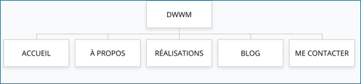

| Compétences | Critères de validation |
| --- | --- |
| Produire et publier du contenu | Qualité et pertinence des contenus publiés |
| Assurer la visibilité des contenus |  |
| Ajouter et modifier des utilisateurs |  |
| Créer des pages et des articles |  |
| Insérer des images, des vidéos |  |
| Travailler la mise en page |  |
| Organiser les pages à l'aide de menus |  |
| Organiser les articles en catégories |  |
| Manipuler des extensions |  |

## Description du contexte

En tant que stagiaire, vous souhaitez créer un site WordPress qui vous servira de CV (Curriculum Vitae) et de vitrine technologique (blog, réalisations…).

## Objectifs

Ce site doit vous servir de carte de visite numérique pour vos futurs entretiens professionnels

## Couleurs à utiliser

Vous êtes libre de choisir la palette de couleurs que vous souhaitez.

En panne d'inspiration ? Essayez [Coloors.co](https://coolors.co/) 

## Structure du site

- **ACCUEIL** : accroche / présentation de la démarche – de l’objectif recherché + liens vers les pages internes

- **À PROPOS** : vous présenter
    - PASSIONS & LOISIRS : vos centres d’intérêts
    - FORMATION
        - DWWM : vos compétences acquises + mise en avant des avantages de la CCI (salles équipées, intervenants professionnels, diplômes reconnus, ambiance, …)
        - DÉBOUCHÉS : les métiers auxquels vous prépare le titre DWWM

- **RÉALISATIONS** : vos expériences professionnelles, vos réalisations (portfolio)

- **BLOG** : articles de blog (voir détails plus bas)

- **ME CONTACTER** : 
    - Votre numéro de téléphone
    - Votre adresse électronique 
    - Vos éventuels liens vers les réseaux sociaux
    - Une carte Google Map ou OpenStreetMap pour vous localiser (faible niveau de zoom) + formulaire de contact + bouton de téléchargement de votre CV (format PDF)

Pensez à mettre un lien sur vos différentes pages pour renvoyer vers la page CONTACT.

### Commentaires

Appliquer la configuration suivante :

- Les commentaires doivent être ouverts
- Ils doivent être affichés en commençant par les plus récents
- La modération devra être effectuée manuellement

## Travail à réaliser

Travail à réaliser individuellement (ou éventuellement en binôme) sur la base du CMS WordPress.

1.	Sélectionner ou créer un thème
    - En manque d'inspiration ? Recherchez des blogs de développeurs pour vous inspirer

2.	Réalisez l’arborescence du site et renseigner le contenu

3.	Configurez les commentaires

4.	Ajoutez un compte utilisateur avec rôle Administrateur pour le nouveau webmaster : Vous

5.	Ajouter un compte utilisateur avec le rôle Auteur dont l’identifiant est « formateur » et le mot de passe « Toto_is_Back68 »

6.	Appliquer les codes couleurs que vous avez choisis

7.	Ajoutez 3 widgets en pied de page :
    - Widget texte pour indiquer vos coordonnées de contact
    - Widget menu pour accéder aux pages légales (mentions, RGPD, confidentialité)
    - Widget image pour votre photo

8.	Générez le cadre légal : 
    - Bandeau des cookies
    - Page Politique des cookies (Extension Complianz)
    - Page RGPD / Politique de confidentialité
    - Page Mentions légales

9.	Créez un article annonçant votre stage en le plaçant dans une catégorie pertinente, et en l’annonçant dès la page d’accueil du site web.

10.	Réalisez toutes les actions permettant d’améliorer le référencement naturel de vos contenus auprès de l’audience cible (choix des mots-clés, mise en gras des mots-clés importants, titres H2 et H3, minimum 300 mots par page, liens externes, nom et texte ALT des images

11.	Optionnel : Créez un compte Google Analytics avec votre adresse gmail et le paramétrer pour votre site web (Google Site kit)

> Vous travaillerez particulièrement les textes (respect de l’orthographe et de la grammaire), le design et le confort de navigation.

**Votre site et thème doivent être « responsive »** en respectant l'approche *Mobile First*.

### Formulaire de contact 

Les plugins gratuits recommandés pour la création de votre formulaire de contact : 
- Contact Form 7 
ou 
- WPForms.

Champs du formulaire de contact :
- Votre nom (obligatoire)
- Votre courriel (obligatoire)
- Votre message
- Votre téléphone

Pour vous aider : 
- [Documentation Contact Form 7](https://contactform7.com/recaptcha/) 
- [Documentation WP Forms](https://wpforms.com/docs/how-to-set-up-and-use-recaptcha-in-wpforms/)

**Bonus :** Protégez votre formulaire de contact avec Google reCAPTCHA.
