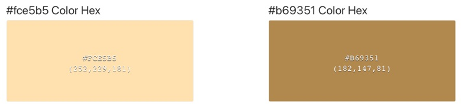
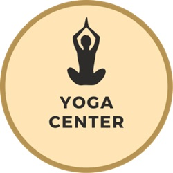
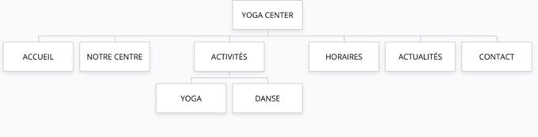

| Compétences | Critères de validation |
| --- | --- |
| Produire et publier du contenu | Qualité et pertinence des contenus publiés |
| Assurer la visibilité des contenus |  |
| Ajouter et modifier des utilisateurs |  |
| Créer des pages et des articles |  |
| Insérer des images, des vidéos |  |
| Travailler la mise en page |  |
| Organiser les pages à l'aide de menus |  |
| Organiser les articles en catégories |  |
| Manipuler des extensions |  |

## Description du contexte

**YOGA CENTER** est un centre de yoga, créé par Théophile Rastafaraï.

- **Adresse :** 7 rue de la mairie, 68100 Mulhouse.
- **Horaires d’ouverture :** du lundi au samedi, de 8h à 23h.

Le centre a été créé en s’associant avec plusieurs professeurs et souhaite développer sa clientèle auprès des enfants.

Une journée portes ouvertes est organisée le 1er septembre prochain : les enfants (accompagnés de leurs parents) pourront tester différents cours. Les visiteurs pourront également s’abonner au centre YOGA CENTER pour l’année (abonnement à 400 € au lieu de 500 €, uniquement dans le cas d’un abonnement sur place, le jour de cette journée portes ouvertes). 

Depuis peu, le centre s’est associé à une école de danse qui propose différents cours (hip / hop, modern jazz, danse contemporaine, …).

## Objectifs

YOGA CENTER souhaite créer un site vitrine permettant de présenter l’offre, l’histoire de sa fondatrice ainsi que les professeurs du centre. Ce site doit améliorer leur visibilité sur le web.
- Tous les cours doivent être répertoriés
- Les internautes doivent pouvoir s’inscrire via un formulaire
- Les internautes doivent pouvoir réserver en ligne un cours
- Yoga et danse devront être présentés distinctement

Une refonte graphique a été validée par les dirigeants, avec un changement de codes couleurs.

## Couleurs à utiliser

 

## Logo à utiliser 

## Structure du site

- **ACCUEIL** : Message de bienvenue, qui sommes nous

- **NOTRE CENTRE** : Présentation de la salle et des moyens (matériel, professeurs, …)

- **ACTIVITÉS** : Présentation des différents cours
    - Activités Yoga
    - Activités 

- **HORAIRES** : Présentation des horaires d'ouverture

- **ACTUALITÉS** : Le blog du centre de Yoga

- **CONTACT** : Formulaire de contact, Coordonnées postales, une carte Google Map ou OpenStreetMap et un formulaire de contact

Pensez à mettre des liens pour réserver / contacter l’entreprise sur toutes les pages du site.

### Commentaires

Appliquer la configuration suivante :

- Les commentaires doivent être ouverts
- Ils doivent être affichés en commençant par les plus récents
- La modération devra être effectuée à postériori

## Travail à réaliser

Travail à réaliser individuellement (ou éventuellement en binôme) sur la base du CMS WordPress.

1.	Créer un thème
    - Le client a retenu le site [https://zen-space.fr/](https://zen-space.fr/) à partir duquel vous devez vous inspirer en respectant les codes couleurs et le logo présentés plus haut.

2.	Réalisez l’arborescence du site 

3.	Créer un article annonçant la journée portes ouvertes, en le plaçant dans une catégorie pertinente, et en l’annonçant dès la page d’accueil du site web. Faites apparaître les catégories dans un emplacement stratégique (menu principal ou barre latérale).

4.	Créer un article mettant en avant les bienfaits du yoga

5.	Appliquer les codes couleurs de l'entreprise

6.	Ajoutez 3 widgets en pied de page :
    - Widget texte pour indiquer vos coordonnées de contact
    - Widget menu pour accéder aux pages légales (mentions, RGPD, confidentialité)
    - Widget image pour votre photo

7.	Générez le cadre légal : 
    - Bandeau des cookies
    - Page Politique des cookies (Extension Complianz)
    - Page RGPD / Politique de confidentialité
    - Page Mentions légales

8.	Ajouter un compte utilisateur avec rôle “Administrateur” pour le nouveau webmaster : Vous

9.	Ajouter 3 comptes utilisateurs : 
    - Un compte avec le nom d’utilisateur « YogaCenter », le rôle Administrateur et le mot de passe « YogaForTh3B3st »
    - Un compte avec le nom d’utilisateur « CommunityManager », le rôle Auteur et le mot de passe « M4sterCh3f »
    - Un compte avec le nom d’utilisateur « Modérateur », e rôle Modérateur et le mot de passe « Père_Fouettard »

> Vous travaillerez particulièrement les textes (respect de l’orthographe et de la grammaire), le design et le confort de navigation.

Utilisation possible des différentes possibilités offertes par le CMS WordPress : Gutenberg, Elementor, et plugins complémentaires (Ultimate Addons for Gutenberg, …).

**Votre site et thème doivent être « responsive »** en respectant l'approche *Mobile First*.

## Ressources

Ajoutez tout élément que vous jugerez utile (ex. intégration de vidéos YouTube répondant à la recherche “les bienfaits du yoga”, …).
N’oubliez pas qu’il existe des bibliothèques d’images libres de droits :

- Pixabay
- Pexels
- Unsplash

Si vous êtes à court de temps, utilisez du texte de remplissage : |
[https://fr.lipsum.com](https://fr.lipsum.com)

### Formulaire de contact 

Les plugins gratuits recommandés pour la création de votre formulaire de contact : 
- Contact Form 7 
ou 
- WPForms.

Champs du formulaire de contact :
- Votre nom (obligatoire)
- Votre courriel (obligatoire)
- Votre message
- Votre téléphone

Pour vous aider : 
- [Documentation Contact Form 7](https://contactform7.com/recaptcha/) 
- [Documentation WP Forms](https://wpforms.com/docs/how-to-set-up-and-use-recaptcha-in-wpforms/)

**Bonus :** Protégez votre formulaire de contact avec Google reCAPTCHA.
