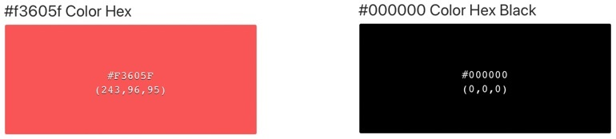
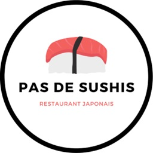
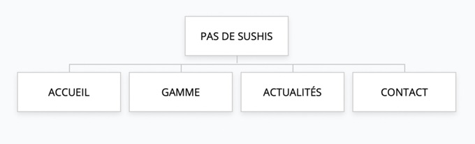

| Compétences | Critères de validation |
| --- | --- |
| Produire et publier du contenu | Qualité et pertinence des contenus publiés |
| Assurer la visibilité des contenus |  |
| Ajouter et modifier des utilisateurs |  |
| Créer des pages et des articles |  |
| Insérer des images, des vidéos |  |
| Travailler la mise en page |  |
| Organiser les pages à l'aide de menus |  |
| Organiser les articles en catégories |  |
| Manipuler des extensions |  |

## Description du contexte

**PAS DE SUSHIS** est un restaurant japonais situé à Aubière, créé par Robert LIN.
- **Adresse :**  8 Av. Lavoisier, 63170 Aubière
- **Horaires d’ouverture :** du mardi au dimanche, de 11h à 23h.

Monsieur LIN, le gérant, vous demande de créer un site internet afin de mettre en valeur l’offre de son restaurant japonais qui s’est récemment implanté.
L’enseigne propose une variété de sushis, makis, yakitoris, sashimis, des boissons et entrées telles que des soupes miso, des salades de chou … Des menus sont également proposés.
Les clients peuvent manger sur place ou choisir l’option à emporter. Un service de livraison est également proposé contre supplément.

## Objectifs

PAS DE SUSHIS souhaite créer un site vitrine permettant de présenter l’offre de lancement (20 % de réduction pour les 100 premiers clients) et vous charge du teasing à l’aide d’articles de blog. Ce site doit améliorer leur visibilité sur le web.

- Toute la gamme doit être répertoriée : carte et formules des menus

- Les internautes doivent pouvoir
    - Visualiser l’offre de lancement
    - Être rassurés face au COVID grâce à la mise en avant des mesures mises en place par l’établissement
    - Contacter le restaurant pour réserver (formulaire de contact et numéro de téléphone)

Une refonte graphique a été validée par le dirigeant, avec un changement de codes couleurs.

## Couleurs à utiliser

 

## Logo à utiliser 

## Structure du site

- **ACCUEIL** : Message de bienvenue, qui sommes nous, mise en avant du plat du jour

- **GAMME :** carte et formules des menus

- **ACTUALITÉS** : Le blog du centre de Yoga

- **CONTACT :** contient les coordonnées postales, le numéro de téléphone pour réserver, une carte Google Map ou OpenStreetMap et un formulaire de contact

Pensez à mettre des liens en évidence pour réserver / contacter l’entreprise.

### Commentaires

Appliquer la configuration suivante :

- Les commentaires doivent être ouverts aux utilisateurs inscrits uniquement
- Ils doivent être affichés en commençant par les plus récents
- La modération devra être effectuée manuellement

## Travail à réaliser

Travail à réaliser individuellement (ou éventuellement en binôme) sur la base du CMS WordPress.

1.	Créer un thème
    - Le dirigeant a retenu le site [https://sushibar-mulhouse.fr/](https://sushibar-mulhouse.fr/) à partir duquel vous devez vous inspirer en respectant les codes couleurs et le logo présentés plus haut.

2.	Réalisez l’arborescence du site 

3.	Créer un article annonçant l’offre de lancement, en le plaçant dans une catégorie pertinente, et en l’annonçant dès la page d’accueil du site web. Faites apparaître les catégories dans un emplacement stratégique (menu principal ou barre latérale).

4.	Créer un article mettant en avant les bienfaits de la cuisine asiatique

5.	Appliquer les codes couleurs de l'entreprise

6.	Ajoutez 3 widgets en pied de page :
    - Widget texte pour indiquer vos coordonnées de contact
    - Widget menu pour accéder aux pages légales (mentions, RGPD, confidentialité)
    - Widget image pour votre photo

7.	Générez le cadre légal : 
    - Bandeau des cookies
    - Page Politique des cookies (Extension Complianz)
    - Page RGPD / Politique de confidentialité
    - Page Mentions légales

8.	Ajouter un compte utilisateur avec rôle “Administrateur” pour le nouveau webmaster : Vous

9.	Ajouter 2 comptes utilisateurs : 
    - Un compte avec le nom d’utilisateur « Dirigeant », le rôle Administrateur et le mot de passe « YabonSushis »
    - Un compte avec le nom d’utilisateur « Gerant », le rôle Auteur et le mot de passe « JeG3reLesResas »

10. Autoriser les visiteurs du site à créer un compte utilisateur.

> Vous travaillerez particulièrement les textes (respect de l’orthographe et de la grammaire), le design et le confort de navigation.

Utilisation possible des différentes possibilités offertes par le CMS WordPress : Gutenberg, Elementor, et plugins complémentaires (Ultimate Addons for Gutenberg, …).

**Votre site et thème doivent être « responsive »** en respectant l'approche *Mobile First*.

## Ressources

Ajoutez tout élément que vous jugerez utile (ex. intégration de vidéos YouTube répondant à la recherche “les bienfaits du yoga”, …).
N’oubliez pas qu’il existe des bibliothèques d’images libres de droits :

- Pixabay
- Pexels
- Unsplash

### Formulaire de contact 

Les plugins gratuits recommandés pour la création de votre formulaire de contact : 
- Contact Form 7 
ou 
- WPForms.

Champs du formulaire de contact :
- Votre nom (obligatoire)
- Votre courriel (obligatoire)
- Votre message
- Votre téléphone

Pour vous aider : 
- [Documentation Contact Form 7](https://contactform7.com/recaptcha/) 
- [Documentation WP Forms](https://wpforms.com/docs/how-to-set-up-and-use-recaptcha-in-wpforms/)

**Bonus :** Protégez votre formulaire de contact avec Google reCAPTCHA.

### Système de réservations

Lorsque le site est entièrement fonctionnel, créer un **plugin** Wordpress qui ajoute le comportement suivant au site :

- Les utilisateurs possédant un compte peuvent réserver **X** couverts à partir du site (le restaurant peut accueillir 50 couverts).
- Les utilisateurs ayant réservé peuvent annuler leur(s) réservation(s) si elle se situe(nt) dans le futur.
- Le gérant et/ou le dirigeant peuvent afficher la liste des réservations, accepter ou refuser une réservation (validation manuelle).

### Système de commandes en ligne

Lorsque le système de réservation est fonctionnel, créer un **plugin** Wordpress qui ajoute le comportement suivant au site :

- Les utilisateurs possédant un compte peuvent commander des plats à emporter ou en livraison.
- Les utilisateurs ayant commandé peuvent annuler leur commande si celle-ci n'est pas déjà partie en livraison.
- Le gérant et/ou le dirigeant peuvent afficher la liste des commandes en cours, accepter ou refuser une commande (validation manuelle) et modifier le statut de la commande (en préparation, livraison en cours, livrée).
