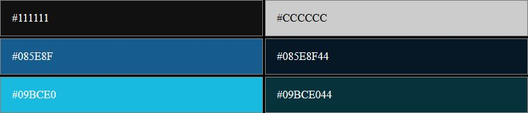
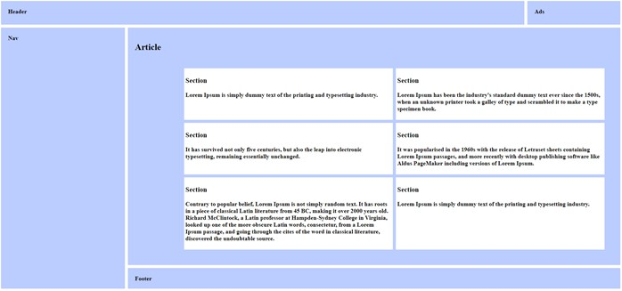

Réalisez les pages HTML correspondant aux maquettes de chaque exercice.
Utilisez en priorité FLEX et GRID pour positionner les éléments.

## CATS

### Couleurs : 

### Informations 
La police d'écriture utilisée est "Arial".

Les images sont accessibles en cliquant sur les liens suivants : [cat1.jpg](img/cat1.jpg), [cat2.jpg](img/cat2.jpg), [cat3.jpg](img/cat3.jpg).

--- 

## Basic Template

 Version alternative (mode clair) : [Maquette, mode clair](img/02-basic-template-light.jpg)

L'affichage doit respecter le choix de l'utilisateur (mode clair ou sombre).  Au chargement de la page, la version correspondant au choix de l'utilisateur est affichée. Ceci est réalisé grâce à *prefers-color-scheme* du langage CSS. Documentez-vous sur le site MDN :  [prefers-color-scheme sur MDN](https://developer.mozilla.org/en-US/docs/Web/CSS/@media/prefers-color-scheme).

### Couleurs : 

### Informations :

La police d'écriture utilisée est "Arial"

- Hauteur de l'entête : 200px.
- Largeur des 2 blocs latéraux : 240px.
- La partie centrale occupe tout l'espace disponible.

Les images : 
- La bannière : [basic-template-banner.png](img/basic-template-banner.png)
- La publicité : [basic-template-aside.jpg](img/basic-template-aside.jpg)

**Bonus :** Proposez une version « mobile » à 1 colonne.

---

## GRID 1

Couleurs : 
-	Bleu : #BBCCFF

Bonus : Proposez une version « mobile » à 1 colonne.

 
## GRID ? FLEX ?

Couleurs : 
-	Jaune/Vert : #CCCC33

Bonus : Proposez une version « mobile » à 2 colonnes (sauf les éléments 1 et 10 qui utilisent toute la largeur).
